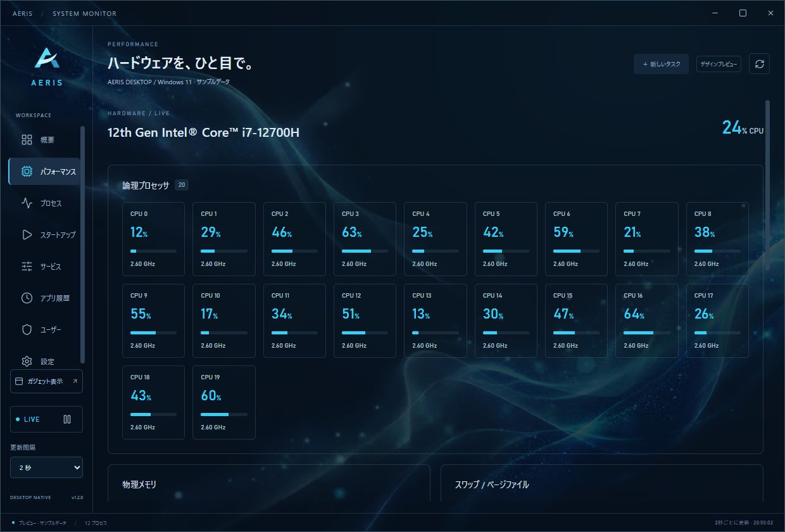
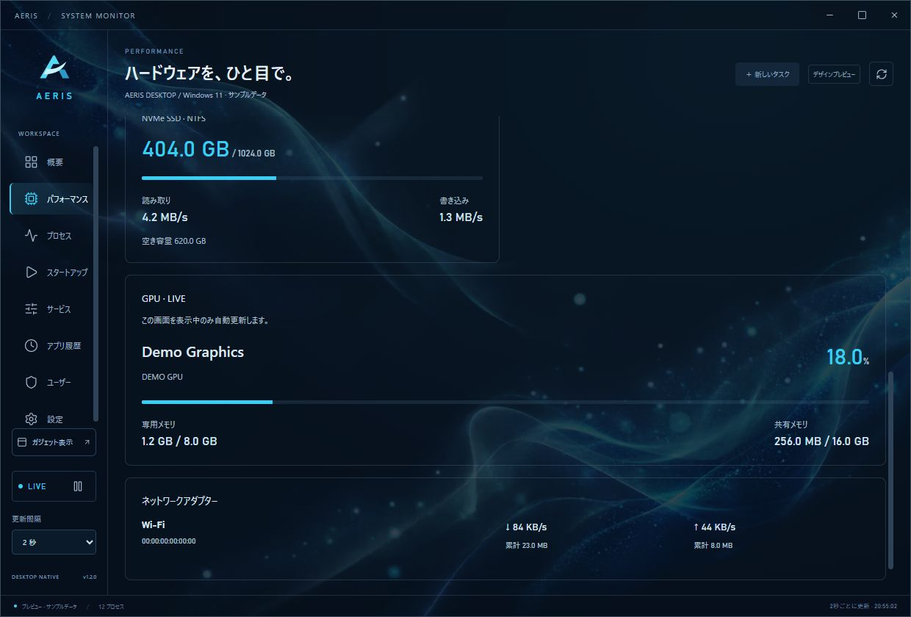
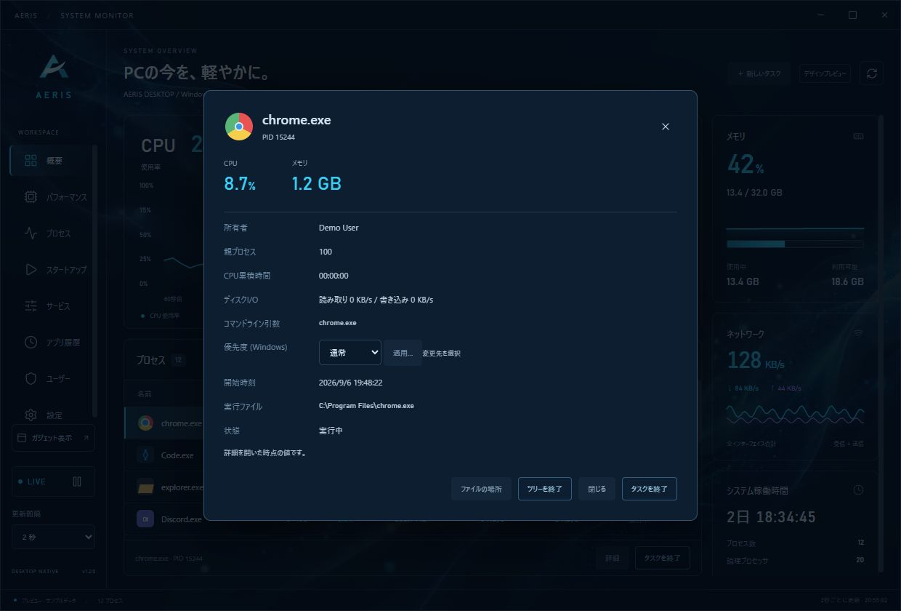

<div align="center">
  
  <p>透けるウィンドウで、PCの今を見守る。<br>Windows・macOS・Linux向けのシステムモニター & 常駐ガジェット。</p>
  <p><a href="https://github.com/Sunwood-ai-labs/AERIS/actions/workflows/desktop.yml"></a>   </p>
  <p><a href="README.md">English</a> · <strong>日本語</strong></p>
  <p><a href="https://github.com/Sunwood-ai-labs/AERIS/releases/latest"><strong>最新版をダウンロード</strong></a> · <a href="https://github.com/Sunwood-ai-labs/AERIS/actions/workflows/desktop.yml">ビルド状況</a></p>
</div>

## 🫧 AERISについて

濃紺とシアン、透明感のある静かなデザイン。CPU・メモリ・ネットワークの状態を、メイン画面・常駐ガジェット・横長ミニバーで確認できます。

- **透ける画面**：背後のデスクトップが見える半透明表示。文字とグラフの不透明度は維持します。
- **3つの表示形態**：詳細なメイン画面、340 × 520のガジェット、560 × 76のミニバー。
- **静かな常駐**：1 / 2 / 5秒の更新間隔。すべての画面が非表示・最小化中は定期計測を停止。
- **生成背景**：オーロラ・ガラスの波・星雲。初期設定では30秒ごとにランダム再生し、同じ画像を連続表示しません。
- **プロセスを確認**：名前・PID検索、CPU・メモリの並べ替え、詳細と終了確認。
- **ローカルで動作**：ログイン・外部サーバー不要。AERISによる利用状況の収集・送信はありません。

## 🧰 タスクマネージャーの基本機能

1.2では、日常的に使うタスク管理機能を追加しました。

| 項目 | 機能 |
|---|---|
| プロセス・詳細 | CPU・メモリ・ディスクI/O順、所有者・親PID・引数・開始時刻・CPU時間、ファイルの場所 |
| 操作 | 新しいタスクの実行、単独／ツリー終了、Windowsの優先度変更・Explorer再起動 |
| パフォーマンス | 論理CPU使用率・周波数、物理メモリ・スワップ、ディスク容量・読み書き速度、アダプター別通信量 |
| GPU（Windows） | パフォーマンス画面の表示中にPDH使用率・専用／共有メモリを自動更新。取得不可も明示 |
| アプリ履歴 | 観測開始後のCPU累積時間と最大メモリ。終了したプロセスも保持、リセット可能 |
| ユーザー | 所有者別の負荷とプロセス絞り込み、Windowsのサインインセッション一覧 |
| スタートアップ（Windows） | Runレジストリ・スタートアップフォルダーの有効／無効切り替え。起動コマンドは保持 |
| サービス（Windows） | 状態・PID・起動方法、検索、開始／停止／再起動、重要サービスの保護 |

変更操作はアプリ内で確認します。権限不足はエラーとして表示し、自動昇格しません。スタートアップ・サービス・セッションは必要時に取得し、ガジェット常駐中には定期実行しません。Windows管理機能にはWindows PowerShell 5.1とOSの情報取得機能を使用します。スタートアップ状態はWindowsの `StartupApproved` レジストリ形式を利用し、未知の形式は変更しません。変更前の値は `HKCU\Software\AERIS\StartupStateBackup` に保存します。

AERISの履歴はWindowsが保持する過去のUWP履歴とは別です。タスクスケジューラー・パッケージアプリの自動起動、起動時の影響度、プロセス別通信量、効率モード、CPU割り当て、ダンプ、ユーザーログオフは未実装です。取得権限がないプロセス項目もあります。[機能の検証表](docs/task-manager-coverage.md)

## 📸 スクリーンショット

実装済みUIのブラウザープレビューを撮影しています。数値・プロセス名はサンプルデータです。OS別の実機画面ではなく、ネイティブの透過効果は背後の壁紙やOSによって変わります。

### メイン画面


### 常駐ガジェットとミニバー

| デスクトップガジェット | 横長ミニバー |
|---|---|
|  |  |

### パフォーマンスとプロセス詳細



<details>
<summary>GPU・ネットワークアダプター・プロセス管理を見る</summary>





</details>

<details>
<summary>背景・透明度の設定画面を見る</summary>


</details>

## 📦 ダウンロードと起動

[Releases](https://github.com/Sunwood-ai-labs/AERIS/releases/latest) から、自分のOS・CPUに合うファイルを選んでください。以下の `1.2.0` はバージョン番号です。

| OS / CPU | 配布ファイル | 起動方法 |
|---|---|---|
| Windows x64 | `AERIS-1.2.0-windows-x64-setup.exe` | インストーラーを実行 |
| Windows x64・ポータブル | `AERIS-1.2.0-windows-x64-portable.zip` | フォルダー全体を展開して `AERIS/AERIS.exe` を起動 |
| macOS・Apple Silicon | `AERIS-1.2.0-macos-arm64.dmg` | 開いてAERISをApplicationsへコピー |
| macOS・Intel | `AERIS-1.2.0-macos-x64.dmg` | 開いてAERISをApplicationsへコピー |
| Linux x64・Debian/Ubuntu系 | `AERIS-1.2.0-linux-x64.deb` | `sudo apt install ./AERIS-1.2.0-linux-x64.deb` |
| Linux x64・AppImage | `AERIS-1.2.0-linux-x64.AppImage` | 実行権限を付けて起動 |

Windowsでは [WebView2 Runtime](https://developer.microsoft.com/microsoft-edge/webview2/) が必要です。ZIPにDLLが含まれる場合は実行ファイルと一緒に配置してください。macOSは12.0以降を対象とし、OSのWKWebViewを利用します。LinuxはUbuntu 22.04でビルドし、WebKitGTK 4.1を使用します。DEBは依存パッケージをAPTで解決します。AppImageの起動には環境に応じてFUSE 2互換ライブラリが必要です。

```sh
chmod +x AERIS-1.2.0-linux-x64.AppImage
./AERIS-1.2.0-linux-x64.AppImage
```

各ファイルにSHA-256チェックサムを同梱しています。Windows版はAuthenticode未署名、macOS版はアドホック署名でAppleの公証は未実施です。そのためOSの初回起動確認が表示されることがあります。

**検証範囲**：Windows 11 x64ではネイティブ画面を確認しています。4構成すべてでCIビルド・単体テスト・ネイティブ統合テストを実行します。macOS/LinuxのGUI操作・透過表示は実機で未確認です。Linuxのトレイはデスクトップ環境や拡張機能、透過・最前面固定・配置はコンポジターやWaylandの制約によって異なります。

## 🎛️ 使い方

| 操作 | 内容 |
|---|---|
| 概要 | CPUの直近60秒グラフ、メモリ、ネットワーク、稼働時間 |
| プロセス | 名前・PID検索、列見出しで並べ替え、選択して詳細・終了 |
| ガジェット表示 | 小窓を表示。ピンで最前面固定、マイナスでミニバーに切り替え |
| 設定 → 透ける背景 | ランダム再生・画像固定・画像なし、切り替え間隔、パネルと画像の濃さ |
| 閉じる | Windows/macOSは非表示、Linuxのメイン画面は最小化。ガジェットの×は小窓だけを非表示 |
| 再表示 | トレイの「メイン画面を開く」。Windowsはトレイ左クリック、macOSはDock、Linuxはタスク切り替えからも復帰 |
| 完全終了 | 設定またはトレイメニュー → AERISを終了 |

`Ctrl+F` で検索、`F5` で即時更新、`Esc` でダイアログを閉じる / 検索をクリア。

設定はユーザーのアプリ設定フォルダーに保存します。初期値はパネル70%、画像24%。背景の切り替えは15秒・30秒・1分・5分。設定はメイン画面とガジェットに共通で、ランダム順序は各ウィンドウで独立します。OS起動時の自動起動登録は行いません。

## ⚡ 軽量化の方針

Tauri 2 + Rustと小さなTypeScriptフロントエンドで構成し、WindowsはWebView2、macOSはWKWebView、LinuxはWebKitGTKを利用します。独立したChromium一式やバックグラウンドサービスは同梱しません。

計測処理は1つで全画面に共有し、プロセス一覧は表示範囲を中心に描画します。非表示・最小化中は背景の切り替えタイマーを止め、WindowsではWebView2の省メモリ設定も適用します。背景は静止画で、フェードは切り替え時の1.2秒だけです。

CPU・メモリの使用量はOSのWebView、開いている画面数、背景画像、環境によって変わります。実行ファイルのサイズと実行時メモリは別の指標です。

## 🛠️ 開発・ビルド

Node.js 22以降、Rust stable、および [TauriのOS別前提条件](https://v2.tauri.app/start/prerequisites/) が必要です。Windows標準はMSVC + Microsoft C++ Build Tools、macOSはXcode Command Line Tools、LinuxはWebKitGTK/GTKなどの開発パッケージを使用します。

```sh
git clone https://github.com/Sunwood-ai-labs/AERIS.git
cd AERIS
npm ci
npm run desktop
```

```sh
npm test
npm run build
cargo test --release --locked --manifest-path src-tauri/Cargo.toml
npm run tauri -- build
```

WindowsでMinGW-w64を使う場合はGNU toolchainをインストールし、PowerShellで `$env:RUSTUP_TOOLCHAIN='stable-x86_64-pc-windows-gnu'` を設定してください。`gcc`・`windres`・`dlltool` をPATHから実行できるようにします。ローカル用 `./build.ps1` はGNUを選択してビルド・テストし、`release/AERIS-Windows-x64.zip` を作成します。配布ファイルの置き換え前にはAERISを完全終了してください。

`npm run dev` はサンプル表示のブラウザープレビューです。ネイティブ版の接続エラーをサンプルで代用しません。

## 🚀 CI/CD

[Desktop builds](.github/workflows/desktop.yml) がWindows x64、macOS arm64/x64、Linux x64をそれぞれのOSランナーでビルドします。

1. `main`へのコード変更・Pull Request・手動実行で、フロントエンドとRustの単体テスト、アイコン再生成の一致確認、ネイティブビルド、統合テストを実行。
2. インストーラー・ポータブル版・チェックサムをActionsのArtifactsへ保存（14日間）。README・スクリーンショットだけの変更ではネイティブ再ビルドを省略します。
3. `v1.2.0` のようなバージョンタグをpushすると全構成をビルドし、**全構成の成功後**にGitHub Releaseを作成・公開します。

リリース時は `package.json` / `package-lock.json`、`src-tauri/Cargo.toml` / `Cargo.lock`、`src-tauri/tauri.conf.json` と画面のバージョン表記を揃えてからタグを付けます。秘密鍵や署名証明書は現在不要です。公証・正式コード署名は別途設定が必要です。

## 🔬 計測の仕様

- CPUは全論理プロセッサに対する実行時間の割合。Windows標準タスクマネージャーの周波数補正値とは異なる場合があります。
- プロセスメモリは常駐メモリ（Windowsではワーキングセット）で共有ページを含み、合計は物理メモリ使用量と一致しません。
- ネットワークはループバックを除くインターフェイスの合計。VPNや仮想アダプターでは二重計上される場合があります。
- 自分自身と既知のOS重要プロセスの終了を防ぎ、終了時はPIDと開始時刻を再確認します。権限で取得・終了できないプロセスもあります。
- `--self-test <出力JSON>` は実データ取得、新しいタスクへの引数の受け渡し、専用の子プロセス・プロセスツリーの終了と保護処理を検証します。`--gpu` を追加すると取得可能なWindows GPUカウンターも記録します。GUIテストではありません。実機のプロセス名・パスを含む出力JSONはGit・公開CI成果物から除外しています。Windows CIでは専用のプロセス・スタートアップ項目・サービスを使い、優先度変更、有効／無効の往復、サービスの開始・再起動・停止も検証します。

## 🎨 デザインとライセンス

AERISのアイコンは「A」と空気の流れを組み合わせた専用SVGです。[ベクター原本](brand/aeris-mark.svg)を編集し、`npm run icons` でアプリ・トレイ・Windows ICO・macOS ICNS・Linux PNG・READMEバナーを再生成できます。画面内ロゴはSVGを直接表示します。[アイコンの管理方法](brand/README.md)

背景画像は組み込みimagegenで生成したRGBA PNGを同梱しています。[生成の記録](docs/backgrounds.md)を参照してください。

ソースコードは [MIT License](LICENSE)。依存ライブラリについては [THIRD_PARTY.md](THIRD_PARTY.md) に記載しています。
