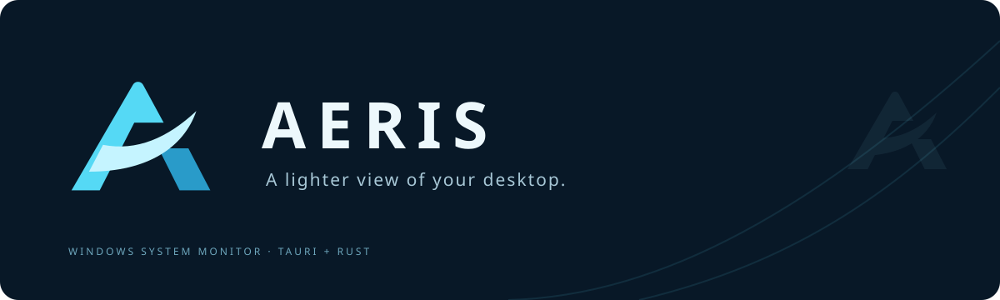

<div align="center">
  
  <p>透けるウィンドウで、PCの今を見守る。<br>Windows向けのシステムモニター & 常駐ガジェット。</p>
  <p><a href="https://github.com/Sunwood-ai-labs/AERIS/actions/workflows/ci.yml"></a>   </p>
  <p><strong>日本語</strong> · <a href="README.en.md">English</a></p>
  <p><a href="https://github.com/Sunwood-ai-labs/AERIS/releases/latest"><strong>Windows版をダウンロード</strong></a></p>
</div>

## 🫧 AERISについて

濃紺とシアン、透明感のある静かなデザイン。CPU・メモリ・ネットワークの状態を、メイン画面・常駐ガジェット・横長ミニバーで確認できます。

- **透ける画面**：背後のデスクトップが見える半透明表示。文字とグラフの不透明度は維持します。
- **3つの表示形態**：詳細なメイン画面、340 × 520のガジェット、560 × 76のミニバー。
- **静かな常駐**：1 / 2 / 5秒の更新間隔。すべての画面が非表示・最小化中は定期計測を停止。
- **生成背景**：オーロラ・ガラスの波・星雲。初期設定では30秒ごとにランダム再生し、同じ画像を連続表示しません。
- **プロセスを確認**：名前・PID検索、CPU・メモリの並べ替え、詳細と終了確認。
- **ローカルで動作**：ログイン・外部サーバー不要。AERISによる利用状況の収集・送信はありません。

## 📦 起動する

1. [Releases](https://github.com/Sunwood-ai-labs/AERIS/releases/latest) から `AERIS-Windows-x64.zip` をダウンロード。
2. ZIPをフォルダー全体で展開。
3. `AERIS/AERIS.exe` を起動。

`WebView2Loader.dll` は実行ファイルと同じフォルダーに置いてください。Windows x64と [Microsoft Edge WebView2 Runtime](https://developer.microsoft.com/microsoft-edge/webview2/) が必要です。Windows 11 x64で動作確認しています。

## 🎛️ 使い方

| 操作 | 内容 |
|---|---|
| 概要 | CPUの直近60秒グラフ、メモリ、ネットワーク、稼働時間 |
| プロセス | 名前・PID検索、列見出しで並べ替え、選択して詳細・終了 |
| ガジェット表示 | 小窓を表示。ピンで最前面固定、マイナスでミニバーに切り替え |
| 設定 → 透ける背景 | ランダム再生・画像固定・画像なし、切り替え間隔、パネルと画像の濃さ |
| 閉じる | メイン画面をトレイへ格納。ガジェットの×はガジェットだけを非表示 |
| トレイを左クリック | メイン画面を再表示 |
| 完全終了 | 設定またはトレイ右クリック → AERISを終了 |

`Ctrl+F` で検索、`F5` で即時更新、`Esc` でダイアログを閉じる / 検索をクリア。

設定はユーザーのアプリ設定フォルダーに保存。パネルの濃さは初期値70%、画像は24%。背景の切り替えは15秒・30秒・1分・5分から選択でき、メイン画面とガジェットに共通です。ランダム順序は各ウィンドウで独立します。Windows起動時の自動起動登録は行いません。

## ⚡ 軽量化の方針

Tauri 2 + Rustと小さなTypeScriptフロントエンドで構成し、システムのWebView2を利用します。独立したChromium一式やバックグラウンドサービスは同梱しません。

計測処理は1つで全画面に共有し、プロセス一覧は表示範囲を中心に描画します。非表示・最小化中の画面にはWebView2の省メモリ設定を適用し、背景の切り替えタイマーも止めます。背景は静止画で、フェードは切り替え時の1.2秒だけです。

メモリ・CPUの使用量はWebView2、表示するウィンドウ数、背景画像、実行環境によって変わります。実行ファイルのサイズと実行時メモリは別の指標です。

## 🛠️ 開発・ビルド

必要なもの：Node.js 22以降、Rust、MinGW-w64（GCC / binutils）、WebView2 Runtime。標準toolchainは `stable-x86_64-pc-windows-gnu` です。

```powershell
git clone https://github.com/Sunwood-ai-labs/AERIS.git
cd AERIS
npm ci
npm run desktop
```

GCC・windres・dlltoolをPATHから実行できるようにしてください。MSVCの場合はMicrosoft C++ Build Toolsを導入し、`$env:RUSTUP_TOOLCHAIN='stable-x86_64-pc-windows-msvc'` を設定して `npm run release` を使えます。`build.ps1` の配布作成はGNU toolchain向けです。

```powershell
npm test
npm run build
cargo test --release --manifest-path src-tauri/Cargo.toml
.\build.ps1
```

`build.ps1` はビルド・テスト・ポータブルZIP作成を行い、`release/AERIS-Windows-x64.zip` を出力します。更新時は起動中のAERISを完全終了してください。

`npm run dev` はサンプル表示のブラウザープレビューです。ネイティブ版の接続エラーをサンプルで代用しません。

## 🔬 計測の仕様

- CPUは全論理プロセッサに対する実行時間の割合で、Windows標準タスクマネージャーの周波数補正された値とは一致しない場合があります。
- プロセスメモリはワーキングセットで、共有ページを含みます。単純合計は物理メモリ使用量と一致しません。
- ネットワークはループバックを除くインターフェイスの合計。VPNや仮想アダプターでは二重計上される場合があります。
- 自分自身とWindowsの重要なプロセスの終了を防ぎ、終了時はPIDと開始時刻を再確認します。権限で取得・終了できないプロセスもあります。
- `--self-test <出力JSON>` は実データ取得と専用に生成した子プロセスの終了・保護処理を検証します。出力には実機のプロセス名・パスが含まれるため、リポジトリでは除外しています。

## 🎨 デザインとライセンス

背景画像は組み込みimagegenで生成したRGBA PNGを同梱しています。[生成の記録](docs/backgrounds.md)を参照してください。

ソースコードは [MIT License](LICENSE)。依存ライブラリ・WebView2に関する情報は [THIRD_PARTY.md](THIRD_PARTY.md) に記載しています。
