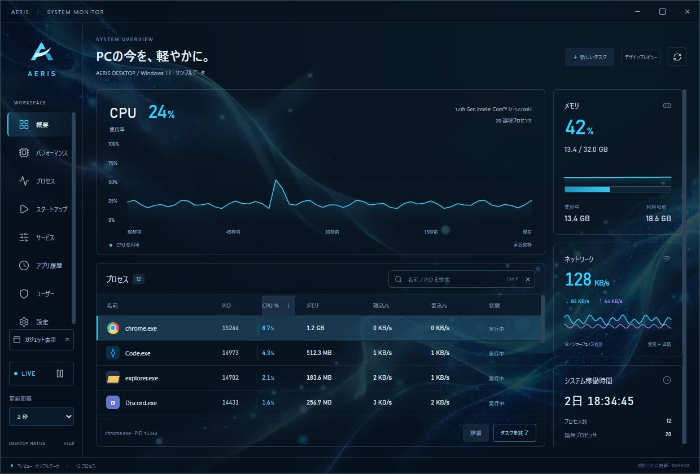
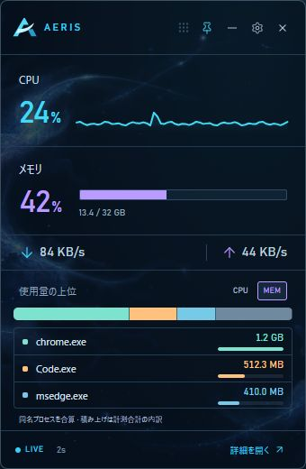
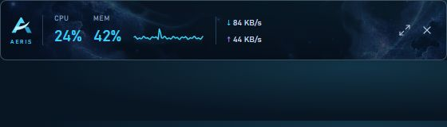
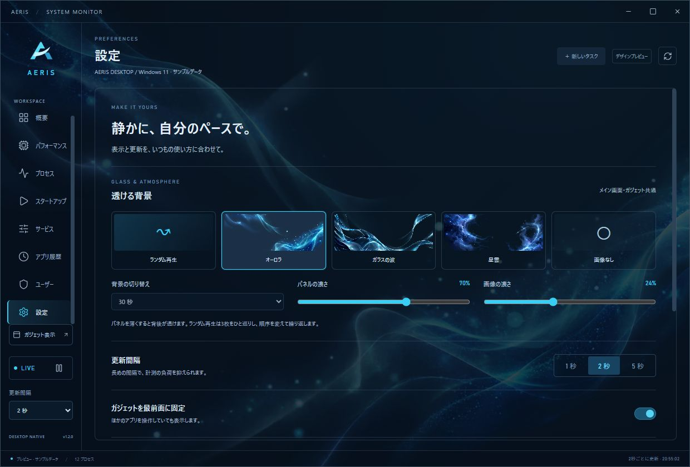

<div align="center">
  
  <p>A translucent system monitor, desktop gadget, and mini-bar for Windows, macOS, and Linux.</p>
  <p><a href="https://github.com/Sunwood-ai-labs/AERIS/actions/workflows/desktop.yml"></a>   </p>
  <p><strong>English</strong> · <a href="README.ja.md">日本語</a></p>
  <p><a href="https://github.com/Sunwood-ai-labs/AERIS/releases/latest"><strong>Download the latest release</strong></a> · <a href="https://github.com/Sunwood-ai-labs/AERIS/actions/workflows/desktop.yml">Build status</a></p>
</div>

## 🫧 Meet AERIS

Midnight blue, cyan accents, and a view through your desktop. Monitor CPU, memory, network traffic, uptime, and processes through a main window, a 340 × 520 gadget, or a 560 × 76 mini-bar. The application interface is currently Japanese.

- Transparent native windows with adjustable surface opacity and fully opaque text and graphs.
- Three generated backgrounds: Aurora, Glass Waves, and Nebula. A shuffled loop changes images every 30 seconds by default, without consecutive repeats.
- Search by name or PID, sort processes, inspect details, and confirm before terminating a process.
- Shared Rust sampling at 1, 2, or 5 seconds. Periodic sampling stops when all windows are hidden or minimized.
- Runs locally without an account or external service. AERIS does not collect or send usage telemetry.

## 📸 Screenshots

These are captures of the implemented UI in its browser preview, using sample metrics and process names. They are not OS-specific native screenshots. Native transparency depends on the desktop behind the window and the operating system.

### Main window



### Desktop gadget and mini-bar

| Desktop gadget | Mini-bar |
|---|---|
|  |  |

<details>
<summary>Background and transparency settings</summary>



</details>

## 📦 Download and run

Choose the package for your OS and CPU from [Releases](https://github.com/Sunwood-ai-labs/AERIS/releases/latest). `1.1.0` below is the version number.

| OS / CPU | File | Install / launch |
|---|---|---|
| Windows x64 | `AERIS-1.1.0-windows-x64-setup.exe` | Run the installer |
| Windows x64 portable | `AERIS-1.1.0-windows-x64-portable.zip` | Extract the whole folder and run `AERIS/AERIS.exe` |
| macOS Apple Silicon | `AERIS-1.1.0-macos-arm64.dmg` | Open and copy AERIS to Applications |
| macOS Intel | `AERIS-1.1.0-macos-x64.dmg` | Open and copy AERIS to Applications |
| Linux x64 Debian/Ubuntu | `AERIS-1.1.0-linux-x64.deb` | `sudo apt install ./AERIS-1.1.0-linux-x64.deb` |
| Linux x64 AppImage | `AERIS-1.1.0-linux-x64.AppImage` | Make executable and launch |

Windows requires [WebView2 Runtime](https://developer.microsoft.com/microsoft-edge/webview2/). Keep any DLLs included in the ZIP beside the executable. macOS targets 12.0+ and uses system WKWebView. Linux packages are built on Ubuntu 22.04 using WebKitGTK 4.1. APT resolves DEB dependencies; AppImage may require a FUSE 2 compatibility library on your distribution.

```sh
chmod +x AERIS-1.1.0-linux-x64.AppImage
./AERIS-1.1.0-linux-x64.AppImage
```

Individual SHA-256 files accompany every package. Windows builds are not Authenticode-signed. macOS builds use ad-hoc signing and are not Apple-notarized, so the OS may prompt or restrict first launch.

**Validation scope:** native UI was checked on Windows 11 x64. CI builds, unit tests, and native integration tests run on all four targets. macOS/Linux GUI interaction and transparency have not been manually verified. Linux tray availability depends on desktop extensions; transparency, positioning and always-on-top behavior depend on the compositor and Wayland restrictions.

## 🎛️ Controls

| Control | Action |
|---|---|
| 概要 / プロセス | Overview / process list |
| ガジェット表示 | Open the gadget; pin for always-on-top, minus for mini-bar |
| 設定 → 透ける背景 | Random loop, fixed image, image off, timing, panel/image opacity |
| Close | Hide on Windows/macOS; minimize the main window on Linux. Closing the gadget hides only the gadget |
| Restore | Tray menu → メイン画面を開く; also Windows tray left-click, macOS Dock, or Linux task switcher |
| AERISを終了 | Quit from settings or the tray menu |

Keyboard shortcuts: `Ctrl+F` search, `F5` refresh, `Esc` close a dialog or clear search.

Preferences persist in the user's application settings directory. Defaults: 70% panel opacity, 24% image opacity. Background intervals: 15 seconds, 30 seconds, 1 minute, or 5 minutes. Appearance preferences are shared, while each window shuffles independently. Automatic startup at login is not registered.

## ⚡ Resource use

AERIS uses Tauri 2, Rust, a small TypeScript frontend, and WebView2 on Windows, WKWebView on macOS, or WebKitGTK on Linux. It does not bundle a separate Chromium distribution or install a background service. One sampler serves all windows; the process table renders around the visible rows.

Hidden/minimized windows stop background rotation timers; on Windows they also receive a WebView2 memory-saving hint. Wallpapers are still images, with a 1.2-second fade only on changes. Resource use depends on the OS webview, open windows, backgrounds, and the machine. Executable size is not runtime memory use.

## 🛠️ Develop and build

Install Node.js 22+, Rust stable, and the [Tauri prerequisites for your OS](https://v2.tauri.app/start/prerequisites/). Windows defaults to MSVC with Microsoft C++ Build Tools; macOS requires Xcode Command Line Tools; Linux requires WebKitGTK/GTK development packages.

```sh
git clone https://github.com/Sunwood-ai-labs/AERIS.git
cd AERIS
npm ci
npm run desktop
```

```sh
npm test
npm run build
cargo test --release --locked --manifest-path src-tauri/Cargo.toml
npm run tauri -- build
```

For MinGW-w64 on Windows, install the GNU Rust toolchain and set `$env:RUSTUP_TOOLCHAIN='stable-x86_64-pc-windows-gnu'` in PowerShell. Put `gcc`, `windres`, and `dlltool` on PATH. The local `./build.ps1` helper selects GNU, builds/tests, and creates `release/AERIS-Windows-x64.zip`. Fully quit AERIS before replacing an existing executable.

`npm run dev` provides a clearly labeled browser sample preview. Native connection errors never silently switch to sample data.

## 🚀 CI/CD

[Desktop builds](.github/workflows/desktop.yml) builds Windows x64, macOS arm64/x64, and Linux x64 on their respective OS runners.

1. Code pushes to `main`, pull requests, and manual runs execute frontend/Rust unit tests, deterministic icon checks, native builds, and integration tests.
2. Installable packages, the Windows portable ZIP, and checksums are uploaded as Actions artifacts for 14 days. README/screenshot-only changes skip native rebuilds.
3. Pushing a version tag such as `v1.1.0` builds every target and automatically publishes a GitHub Release **only after every target succeeds**.

Before tagging, align versions in `package.json` / `package-lock.json`, `src-tauri/Cargo.toml` / `Cargo.lock`, `src-tauri/tauri.conf.json`, and UI labels. No signing secrets are currently needed; official code signing and notarization require separate configuration.

## 🔬 Measurement notes

CPU is execution time normalized across logical processors; it may differ from Windows Task Manager's frequency-adjusted readings. Process memory is resident memory (working set on Windows), including shared pages. Network totals exclude loopback but may double-count VPN/virtual interfaces.

AERIS protects itself and known critical OS processes, checks PID and start time before termination, and requires confirmation. Some process information/actions remain unavailable without sufficient access.

`--self-test <output.json>` checks live sampling, protection, and termination of an exclusively test-created child. It does not test GUI rendering. Its output includes machine process names/paths and is excluded from Git and public CI artifacts.

## 🎨 Design and license

The custom AERIS symbol combines an **A** with a sweep of air. Edit the [vector master](brand/aeris-mark.svg), then run `npm run icons` to regenerate application/tray icons, Windows ICO, macOS ICNS, Linux PNG, and the README banner. The interface renders SVG directly. See the [identity guide](brand/README.md).

Three generated RGBA backgrounds are included. See [generation notes](docs/backgrounds.md). Source code is under the [MIT License](LICENSE); dependency information is in [THIRD_PARTY.md](THIRD_PARTY.md).
